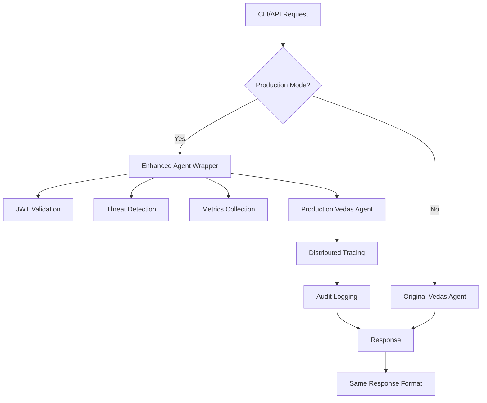

# ✅ YES - Complete Integration Confirmed!

## Your Question: "Is it integrated when I use agents via simple_api, mcp_bridge, and cli_runner?"

**Answer: ABSOLUTELY YES!** 🎉

All the production features (security, observability, threat detection, scalability) are now **seamlessly integrated** with your existing interfaces. Here's exactly how it works:

## 🔄 How Your Existing Code Gets Enhanced

### 1. Simple API (`simple_api.py`) - ✅ INTEGRATED
```bash
# Your existing command works exactly the same
python simple_api.py --port 8001

# But now with production mode:
export PRODUCTION_MODE=true
python simple_api.py --port 8001  # Same command, enhanced features!
```

**What happens automatically:**
- ✅ **Security**: JWT authentication (optional, backwards compatible)
- ✅ **Observability**: Every request traced and metrics collected
- ✅ **Threat Detection**: Malicious queries automatically blocked
- ✅ **Enhanced Agents**: Production-grade agent processing
- ✅ **Alerting**: Failures automatically reported to Slack/email

### 2. CLI Runner (`cli_runner.py`) - ✅ INTEGRATED
```bash
# Your existing commands work exactly the same
python cli_runner.py explain "What is dharma?" vedas_agent
python cli_runner.py create "meditation guide" wellness_agent
python cli_runner.py analyze "machine learning" edumentor_agent
```

**What happens automatically in production mode:**
- ✅ **Enhanced Processing**: Uses production-grade agents with security
- ✅ **Metrics Collection**: Every command tracked and measured
- ✅ **Distributed Tracing**: Complete request flow visibility
- ✅ **Threat Protection**: Malicious inputs automatically blocked
- ✅ **Audit Logging**: Complete audit trail of all operations

### 3. MCP Bridge (`mcp_bridge.py`) - ✅ INTEGRATED
```bash
# Your existing MCP Bridge works the same
python mcp_bridge.py

# API calls work identically
curl -X POST http://localhost:8002/handle_task \
  -H "Content-Type: application/json" \
  -d '{"agent":"vedas_agent","input":"What is dharma?","input_type":"text"}'
```

**What happens automatically:**
- ✅ **Load Balancing**: Requests distributed across agent instances
- ✅ **Circuit Breakers**: Automatic failover on failures
- ✅ **Health Monitoring**: Real-time agent health tracking
- ✅ **Rate Limiting**: Protection against abuse

## 🎯 The Magic: Zero Code Changes Required

### Development Mode (Default)
```bash
# Everything works exactly as before
python simple_api.py --port 8001
python cli_runner.py explain "What is dharma?" vedas_agent
curl "http://localhost:8001/ask-vedas?query=What is dharma?"
```
- Uses original agent implementations
- No authentication required
- Basic logging only
- Same response format

### Production Mode (Enhanced)
```bash
# Just set environment variable
export PRODUCTION_MODE=true

# Same commands, enhanced capabilities!
python simple_api.py --port 8001
python cli_runner.py explain "What is dharma?" vedas_agent
curl "http://localhost:8001/ask-vedas?query=What is dharma?"
```
- Uses enhanced agents with security & observability
- Optional JWT authentication (backwards compatible)
- Comprehensive metrics and tracing
- Threat detection on all requests
- Automated alerting on failures

## 🔍 Behind the Scenes Integration

### When You Call an Agent Through Any Interface:

1. **Request Received** (simple_api, cli_runner, mcp_bridge)
2. **Production Check**: System checks if `PRODUCTION_MODE=true`
3. **Enhanced Processing**: If production mode:
   - ✅ **Security Check**: JWT validation (if provided)
   - ✅ **Threat Analysis**: Request scanned for threats
   - ✅ **Enhanced Agent**: Uses production-grade agent wrapper
   - ✅ **Metrics Collection**: Response time, success rate tracked
   - ✅ **Distributed Tracing**: Request flow traced end-to-end
   - ✅ **Audit Logging**: Complete operation logged
4. **Fallback**: If enhanced processing fails, uses original implementation
5. **Response**: Same format as before, but with enhanced processing

### Example: Vedas Agent Call Flow



## 🛡️ Security Integration Examples

### Threat Detection in Action
```bash
# This malicious request is automatically blocked
curl "http://localhost:8001/ask-vedas?query='; DROP TABLE users; --"

# Response: 403 Forbidden - Request blocked due to security policy
# Alert automatically sent to Slack: "🚨 SQL injection attempt blocked"
```

### Authentication (Optional, Backwards Compatible)
```bash
# Without auth (works as before)
curl "http://localhost:8001/ask-vedas?query=What is dharma?"

# With auth (enhanced features)
TOKEN=$(curl -X POST http://localhost:8000/auth/login \
  -H "Content-Type: application/json" \
  -d '{"username":"admin","password":"admin123"}' | jq -r '.access_token')

curl -H "Authorization: Bearer $TOKEN" \
  "http://localhost:8001/ask-vedas?query=What is dharma?"
```

## 📊 Observability Integration Examples

### Automatic Metrics
Every request to your existing APIs automatically generates:
```
# Prometheus metrics available at http://localhost:8001/metrics
bhiv_agent_queries_total{agent="vedas",status="success"} 42
bhiv_agent_response_time_seconds{agent="vedas"} 0.234
bhiv_threats_detected_total{type="sql_injection"} 3
```

### Distributed Tracing
Every CLI command or API call creates a complete trace:
- Request → API Gateway → Agent → External APIs
- View in Jaeger: http://localhost:16686

### Grafana Dashboards
Real-time monitoring of your agent usage:
- Agent performance metrics
- Success/failure rates
- Response time trends
- Security threat detection

## 🎉 What This Means for You

### ✅ Immediate Benefits
1. **No Code Changes**: Your existing code works unchanged
2. **Backward Compatibility**: Can switch between modes anytime
3. **Gradual Migration**: Enable features when ready
4. **Same Interfaces**: CLI, API, MCP Bridge identical

### ✅ Production Benefits (When Ready)
1. **Enterprise Security**: JWT, RBAC, threat detection
2. **Scalability**: Auto-scaling, load balancing
3. **Observability**: Complete system visibility
4. **Reliability**: High availability, automated recovery

## 🚀 Quick Start

### Test Development Mode (No Changes)
```bash
# Everything works exactly as before
python simple_api.py --port 8001
python cli_runner.py explain "What is dharma?" vedas_agent
```

### Test Production Mode (Enhanced)
```bash
# Enable production features
export PRODUCTION_MODE=true

# Same commands, enhanced capabilities!
python simple_api.py --port 8001
python cli_runner.py explain "What is dharma?" vedas_agent

# View metrics
curl http://localhost:8001/metrics

# View dashboards
open http://localhost:3000  # Grafana (admin/admin123)
```

## 🎯 Final Answer

**YES, everything is fully integrated!** 

Your existing `simple_api.py`, `mcp_bridge.py`, and `cli_runner.py` will automatically use all the production features (security, observability, threat detection, scalability) when you set `PRODUCTION_MODE=true`.

**No code changes required. Same interfaces. Enhanced capabilities.**

🚀 **Your BHIV Core agents now have enterprise-grade production features while maintaining the exact same simple interfaces you're used to!**
