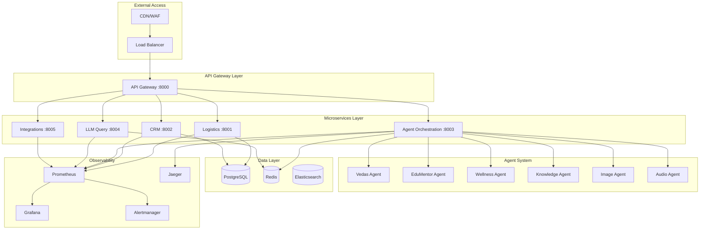
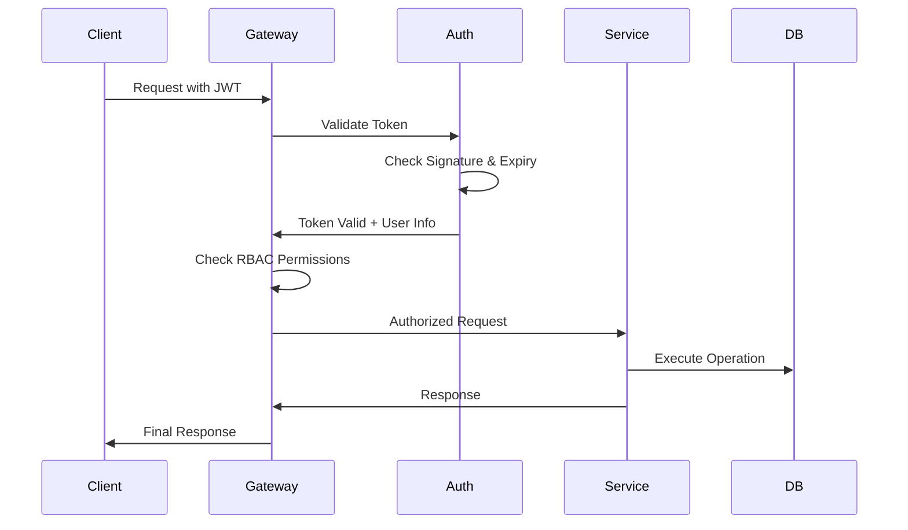
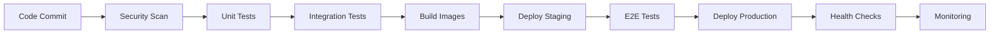

# BHIV Core Production Architecture

## 🏗️ System Overview

BHIV Core has been transformed from an MVP into a production-grade, enterprise-ready AI agent system with comprehensive security, scalability, and observability features.

## 📋 Architecture Components

### 🔐 Security Layer (Days 1-2)
- **OAuth2/JWT Authentication**: Secure token-based authentication across all services
- **Role-Based Access Control (RBAC)**: 5 roles - Admin, Ops, Sales, Customer, Support
- **Data Encryption**: PostgreSQL SSL, bcrypt password hashing
- **Audit Logging**: Complete CRUD operation tracking

### 🛡️ Threat Mitigation (Day 3)
- **Threat Detection Agent**: Real-time API traffic monitoring, SQL injection detection
- **Threat Response Agent**: Automated IP blocking, admin alerts
- **Proactive Monitoring**: Integration with security pipeline

### 🏢 Microservices Architecture (Days 4-5)
- **Logistics Service** (Port 8001): Supply chain and inventory management
- **CRM Service** (Port 8002): Customer relationship management
- **Agent Orchestration Service** (Port 8003): AI agent coordination
- **LLM Query Service** (Port 8004): Language model interactions
- **Integrations Service** (Port 8005): External API integrations
- **API Gateway** (Port 8000): Central entry point with load balancing

### 🐳 Scalability Infrastructure (Day 6)
- **Docker Containerization**: Individual containers per microservice
- **Docker Compose**: Local development orchestration
- **Kubernetes Manifests**: Production-grade orchestration
- **CI/CD Pipeline**: GitHub Actions with automated testing and deployment
- **Auto-scaling Policies**: HPA configurations for dynamic scaling

### 📊 Observability Stack (Days 7-8)
- **Prometheus**: Metrics collection and storage
- **Grafana**: Visualization dashboards and alerting
- **OpenTelemetry**: Distributed tracing across services
- **Alerting System**: Slack/email notifications for failures
- **Centralized Logging**: Structured logging with correlation IDs

### 🤖 Enhanced Agent System
- **12 Specialized Agents**: Vedas, EduMentor, Wellness, Knowledge, Image, Audio, Text, QnA, Summarizer, Planner, FileSearch, Orchestrator
- **Security Integration**: JWT token validation, RBAC permissions
- **Observability**: Metrics, tracing, and alerting for all agent operations
- **Vaani Integration**: Multilingual content, voice synthesis, platform adaptation

## 🌐 Network Architecture

## 🔄 Data Flow Architecture

### Request Processing Flow
1. **External Request** → CDN/WAF → Load Balancer
2. **API Gateway** → Authentication/Authorization → Rate Limiting
3. **Microservice Routing** → Service-specific processing
4. **Agent Orchestration** → Intelligent agent selection
5. **Response Assembly** → Observability logging → Client response

### Security Flow
1. **JWT Token Validation** → Role extraction → Permission checking
2. **Threat Detection** → Pattern analysis → Risk assessment
3. **Threat Response** → Automated blocking → Alert generation
4. **Audit Logging** → Action recording → Compliance tracking

### Observability Flow
1. **Metrics Collection** → Prometheus scraping → Time-series storage
2. **Distributed Tracing** → OpenTelemetry spans → Jaeger visualization
3. **Log Aggregation** → Structured logging → Elasticsearch indexing
4. **Alerting** → Rule evaluation → Multi-channel notifications

## 📈 Scalability Features

### Horizontal Scaling
- **Kubernetes HPA**: CPU/Memory-based auto-scaling
- **Service Mesh**: Istio for advanced traffic management
- **Database Sharding**: PostgreSQL horizontal partitioning
- **Cache Distribution**: Redis Cluster for high availability

### Performance Optimization
- **Connection Pooling**: Efficient database connections
- **Async Processing**: Non-blocking I/O operations
- **Caching Strategy**: Multi-layer caching (Redis, Application, CDN)
- **Load Balancing**: Round-robin, least-connections, weighted routing

## 🔒 Security Architecture

### Authentication & Authorization

### Threat Detection Pipeline
1. **Traffic Analysis**: Real-time request monitoring
2. **Pattern Recognition**: ML-based anomaly detection
3. **Risk Scoring**: Multi-factor threat assessment
4. **Response Automation**: Immediate threat mitigation
5. **Forensic Logging**: Complete audit trail

## 📊 Monitoring & Alerting

### Key Metrics
- **System Metrics**: CPU, Memory, Disk, Network
- **Application Metrics**: Request rate, response time, error rate
- **Business Metrics**: Agent usage, query success rate, user satisfaction
- **Security Metrics**: Threat detection rate, blocked requests, failed authentications

### Alert Categories
- **Critical**: Service down, security breach, data corruption
- **Warning**: High error rate, performance degradation, capacity issues
- **Info**: Deployment events, configuration changes, scheduled maintenance

## 🚀 Deployment Architecture

### Environment Progression
1. **Development**: Local Docker Compose
2. **Staging**: Kubernetes cluster with production-like setup
3. **Production**: Multi-zone Kubernetes with high availability

### CI/CD Pipeline

## 🔧 Configuration Management

### Environment Variables
- **Security**: JWT secrets, API keys, encryption keys
- **Database**: Connection strings, credentials, pool sizes
- **Observability**: Endpoints, sampling rates, retention policies
- **Features**: Feature flags, rate limits, timeout values

### Service Discovery
- **Kubernetes DNS**: Automatic service resolution
- **Service Registry**: Centralized service catalog
- **Health Checks**: Continuous service monitoring
- **Load Balancing**: Intelligent traffic distribution

## 📋 Operational Procedures

### Deployment Process
1. **Pre-deployment Checks**: Environment validation, dependency verification
2. **Rolling Deployment**: Zero-downtime service updates
3. **Health Verification**: Comprehensive post-deployment testing
4. **Rollback Capability**: Automated rollback on failure detection

### Monitoring Procedures
1. **Real-time Dashboards**: Grafana visualizations
2. **Alert Response**: Escalation procedures and runbooks
3. **Performance Analysis**: Regular capacity planning
4. **Security Reviews**: Continuous threat assessment

### Maintenance Windows
- **Database Maintenance**: Scheduled backup and optimization
- **Security Updates**: Regular patching and vulnerability fixes
- **Capacity Scaling**: Proactive resource allocation
- **Performance Tuning**: Continuous optimization

## 🎯 Success Metrics

### Technical KPIs
- **Availability**: 99.9% uptime target
- **Performance**: <200ms average response time
- **Scalability**: Handle 10x traffic spikes
- **Security**: Zero successful breaches

### Business KPIs
- **Agent Utilization**: 80%+ successful query resolution
- **User Satisfaction**: >4.5/5 rating
- **Cost Efficiency**: 30% reduction in operational costs
- **Time to Market**: 50% faster feature deployment

This production architecture ensures BHIV Core operates as a robust, secure, and scalable enterprise AI platform capable of handling production workloads while maintaining high availability and performance standards.
